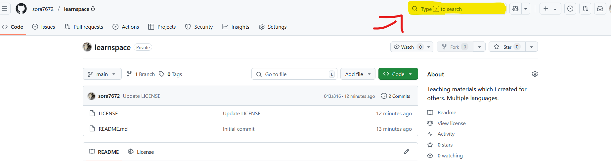

# Learnspace

## What is this?
Basically this is a collection of materials for teaching I prepared for others.  
Inside the `main branch` you only find finalized material. Sometimes only in German, sometimes only in English.  
My main documentation language is English. If you find German materials, they were created for some German natives.

## I'm looking for XYZ...
Try using the search on the top right in GitHub:  


If you use this string and replace `XYZ` with what you search for, you can see if it's found anywhere in this repo:

```
repo:sora7672/learnspace XYZ
```

If it's not found, I haven't taught it. Or to be more precise, I haven't prepared material for it yet.  
Feel free to DM me on Discord if you want to learn stuff.  
I'm always happy to help, **if I have the capacity** at that time!


## How is this structured?
Each top-level folder represents a **topic** or **subject area**.

Inside every folder (and subfolder), you'll find a `README.md` file.  
When browsing the repository through GitHub's web interface, this file is **automatically displayed** when you open the folder.

Each of these `README.md` files explains the **context** of the folder — what the topic is about, what the files are for, and how to use them.

### Note:
>This is the public repo, which does **not** include the **WIP** (**W**ork **I**n **P**rogress) materials.

## Subtopics
- [Java](java/README.md)
- [Python](python/README.md)
- [Mixed](mixed/README.md)
